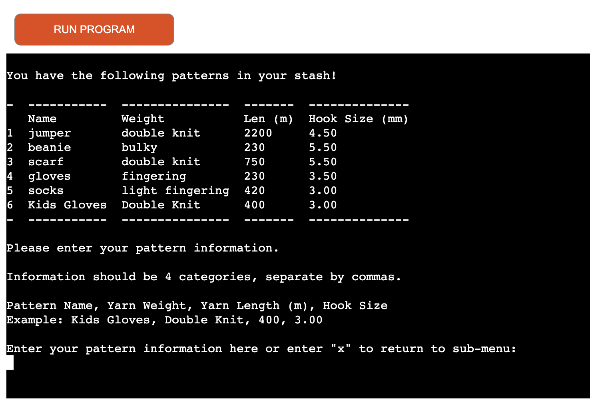

<h1 align="center">Yarn Genie</h1>

[View the live project here](https://yarn-genie.herokuapp.com/)

Yarn Genie is a terminal based application to manage crochet related data such as patterns, yarns, and hooks.

The user can utilise the application to view the data, add data to the database, remove the data, and calculate pattern requirements.

All the data are stored in Google Sheets and is accessed through API.

## Table of Contents
---
* [User Experience](#user-experience)
* [Features](#features)
* [Design](#design)
* [Technologies Used](#technologies-used)
* [Testing](#testing)
* [Deployment](#deployment)
* [Credits](#credits)

## User Experience
---

### As a user, I want to be able to :

1. Identify what is the purpose of the program.
2. Easily navigate through the different functionalities of the program.
3. Use the program to see the patterns/yarns/hooks I have in the database.
4. Use the program to add/remove patterns/yarns/hooks to and from the database
5. Check to see what I can make based on my pattern selection, this information should include :
    * if I have the yarn with the same weight as required in the pattern.
    * if I have enough yarn to make this pattern.
    * if I don't have enough, how much more do I need?
    * if I have the hook required to make the pattern.
    * if I don't have the hook, which size hook do I need?
6. Successfully use the program without encountering any errors.

## Features
---

### Existing Features

* __Main Menu & ASCII Art__

    * The ASCII art and the main menu are displayed when the user starts the program.
    * The particular font used to create the art conveys the feeling that the letters are made from stitches and have a slightly whimsical and magical quality to them.
    * The main menu is simple and easy for the user to understand. The main menu contains 5 options for the user to choose from : 
        1. Patterns-related actions
        2. Yarns-related actions
        3. Hooks-related actions
        4. Calculate action
        5. Exit program

    * The user is prompted to select an option by entering a number respective to the options. If the user enters an incorrect value, an error message will be displayed and prompt the user to re-enter their option.
    * The main menu will keep running until the user selected a valid option or decided to terminate the program.

     

    

     

* __Show Worksheet__

    * The function shows the data in a tabulated form for the user to see what Patterns/Yarns/Hooks they have in the database.
    * Underneath the table, the sub-menu is displayed for the user to select which actions they want to execute.

     

* __Sub-Menu__ 

    * The sub-menu is executed once the user selected a valid option from the main menu.
    * The sub-menu is the same for Patterns/Yarns/Hooks to provide continuity for a better user experience.
    * The sub-menu contains 3 options for the user to select from :
        1. Add Pattern/Yarn/Hook
        2. Remove Pattern/Yarn/Hook
        3. Return to main menu
    * The Add and Remove functions can only be selected via the sub-menu.
    * Option 3 takes the user back to the main menu.
    
     
    
    

     

* __Add Menu__

    * When the user selects the 1st option from the sub-menu, the get_user_data function is called.
    * The user will then be prompted to add data in a Comma Separate Value (CSV) format. An example will be shown above the input field to aid the user with the data entry process
    
     

    
    
    * The user's input will then be validated;
        * If the user's input is valid, the data will be added to the spreadsheet.
        * If the user's input is invalid, the user will be prompted to re-enter the data.
    * After the user has entered valid data, the user will then be prompted to continue the program, and the updated table with the most recently entered data will be displayed.

     
    
    

     

* __Remove Menu__

    * When the user selects the 2nd option from the sub-menu, the remove_item function is called.
    * The user will then be prompted to select a row of data they want to be removed from the database.
    * The user's input will then be validated;
        * If the user's input is valid, the data will be deleted from the spreadsheet.
        * If the user's input is invalid, the user will be prompted to re-enter the data.
    
     

    

     

* __Calculate Menu__

    * The function is executed when the user selected the 4th option from the main menu.
    
     

    
    
    * The user will be prompted to select a pattern from the database.
    
     

    

    * After the selection the program will then calculate these scenarios :
        * Does the user have the correct weight yarn to complete this pattern?
            * TRUE: print out the yarn that will be used. If there is more than 1 match, the user will be prompted to input an option to select from a list. Then move on to the next validation.
                * Does the user have enough of the yarn?
                    * TRUE: print out a message that the user can make this pattern.
                    * FALSE: print out a message that the urges user to go buy more yarn.
            * FALSE: print out a message that the user does not have the correct yarn weight and a message that urges the user to go buy more yarn.
        * Does the user have the correct size hook to complete this pattern?
            * TRUE: print out a message that the user have the correct size hook for the pattern.
            * FALSE: print out a message that the user does not have the correct size hook for the pattern, and urges them to go buy some.

     

    * All the screenshots of the different scenarios can be found [here.](https://github.com/yamesjamess/p3-yarn-genie/tree/main/documentation/support_images/calc_results)

### Feature that could be implemented in the future

* __Graphic User Interface (GUI)__

    * Since the program is run exclusively in the terminal, it is not very user friendly for a human user that has no knowledge of operating the terminal. A web-based or executable program will be more intuitive for the user.

* __Data Duplication Validation__

    * The current version of the program allows the user to enter duplicate data, such as the same yarn multiple times. When Data Duplication Validation is implemented, it can detect duplications in the data and merge them when applicable.

* __Better Data Input Validation__

    * The current version of the program allows the user the input data in CSV format but does not strictly validate the what type of values the user has input. For example, when adding a new pattern the user is given an example "Kids Gloves, Double Knit, 400, 3.00" but if the user input "400, Double Knit, Kids Gloves, 3.00", the program sees this as an valid input.

 

## Design
---

* Lucidchart: Lucidchart's flow chart was utilised during the design and planning stage of the project. It helps provide the developer with a clear path of what functions need to be defined and when each function should be called.

## Technologies Used
---

### Languages Used

* [Python 3.11.1](https://www.python.org/downloads/release/python-3111/)

### Frameworks, Libraries & Programs Used

* [Google Sheets](https://www.google.com/sheets/about/): Used as external data storage for Patterns, Yarns, and Hooks.

* [Google Drive API](https://developers.google.com/drive/api/guides/about-sdk): Used to provide the program access to Google Drive services, which hosts the Google Sheets file.

* [Google Sheets API](https://developers.google.com/sheets/api/guides/concepts): Used to provide the program access to Google Sheets.

* [gspread](https://docs.gspread.org/en/v5.7.1/): Python API for Google Sheets.

* [Google Auth](https://developers.google.com/identity/authorization): Used by the program for the authentication process with Google to access other services such as Google Drive and Google Sheets.

* [Lucidchart](https://www.lucidchart.com/pages/): Used to create a flowchart during the design and planning stage. Outline what function is needed for the program.

* [patorjk.com TAAG](https://patorjk.com/software/taag/): Used to generate ASCII art from plain text.

* [Git](https://git-scm.com/): was used for version controlling purposes through git commands via the terminal on GitPod and is pushed to GitHub for cloud-based storage.

* [GitHub](https://github.com/): is used to host the repository of the project.

* [Heroku](https://heroku.com): is used to host and deploy the program.

## Testing
---

### Validator Testing

* [CI Python Linter](https://pep8ci.herokuapp.com/)

    - result for run.py

    

### Test Cases and Results

* The table below details the testing case that was used and the result of the test.

### Known Bugs

* If the user types in a space before or after their input, either intentionally or not, the user gets an incorrect response.
    * This has been fixed by adding .strip() to user input where the input is expecting certain inputs.

     
* The program is throwing an IndexError when the user selected an index that is out of bounds.
    * This bug has been fixed by checking the length of the list before accessing the index.

* The program is allowing the user to select number beyond the rows that contains data in the remove item function
    * This bug has been fixed by turning the data from the worksheet to a list then limits the user from selecting an option that is beyond the length of the list.

### Unfixed Bugs
* There are no unfixed bugs that the developer is aware of.

## Deployment
---

### How to clone this repository
* Visit the main repository at https://github.com/yamesjamess/p3-yarn-genie.

* Click the "Code" button to the right of the screen, click HTTPs and copy the link present there.

* Open a GitBash terminal and navigate to the directory where you want to clone.

* In the terminal, type "git clone" then paste in the copied URL and press the Enter key to begin the cloning process.

### How to fork this repository
* Visit the main repository at https://github.com/yamesjamess/p3-yarn-genie.

* On the top right-hand corner click on the "Fork" button.

* You will be redirected to a new page, from there enter the name you desire the name the forked repository and click "Create Fork"

* You will now have a Fork copy of the repository on your own repository.

### How to setup and configure Google Sheets and APIs

__Steps to setup and configure access to data__

* Create a spreadsheet on Google Sheets
    * Visit [Google Sheets website](https://www.google.com/sheets/about/)
    * Log in to your Google account, if you do not have a Google account you must create one prior to this step.
    * Create a spreadsheet and name the file "yarn_genie". In the spreadsheet create 2 more worksheets, you should have 3 in total (the 1st one is created by default). Rename them to patterns, yarns, and hooks respectively.
    * In row 1 of the patterns sheet, enter the following headings in each cell: Name, Weight, Len (m), Hook Size (mm)
    * In row 1 of the yarns sheet, enter the following headings in each cell: Name, Material, Weight, Len (m), Colour, Qty.
    * In row 1 of the hooks sheet, enter the following heading in the first cell: Hook Size (mm).
    * The sample data used for this project can be seen [here], however, it is not necessary to use the same data.

     

* Setup APIs using Google Cloud Platform
    * Access [Google Cloud Platform](https://console.cloud.google.com/) 
        * Google Account required.
    * Create a new project on the Google Cloud Platform and give the project a unique name. After creation select the project to go to the project dashboard.
    * Setup Google Sheets API
        * Go to the APIs & Services section from the hamburger menu.
        * Select Library from the menu
        * Search for Google Sheets API
        * Select the Google Sheets API and click Enable
    * Setup Google Drive API and Credentials
        * Go to the APIs & Services section from the hamburger menu.
        * Select Library from the menu
        * Search for Google Drive API
        * Select the Google Drive API and click Enable
        * Wait to be redirected to a new page, once redirected click on Create Credentials
        * Select Google Drive API from the drop-down bar
        * For the "What data will you be accessing?" question, select Application Data.
        * For the "Are you planning to use this API with Compute Engine, Kubernetes Engine, App Engine, or Cloud Functions?" question, select No, I'm not using them.
        * Click Next.
        * Enter a Service Account name, you can call it anything you like - for this project, it will be "YarnGenie" - then click Create.
        * In the Role Dropdown box choose Basic > Editor then press Continue.
        * Then leave the rest of the options blank, and click Done.
        * On the next page, click on the Service Account that has been created.
        * On the next page, click on the Keys tab.
        * Click on the Add Key dropdown and select Create New Key.
        * Select JSON and then click Create. This will trigger the JSON file with your API credentials in it to download to your machine. 
        * Rename the downloaded file to cred.json
        * The file can then be added to the project by dragging and dropping the file into the IDE of choice.
        * If creds.json is not listed in the .gitignore file, here is the time to do so.
        * Open the creds.json file and locate the "client email", and copy the email.
        * Go to your yarn_genie spreadsheet on Google Sheets, click on the Share button and paste the email in the field and provide it with Editor privileges.

### How to deploy the program on Heroku

__Steps to deploy the project on Heroku__

* Update the requirements.txt file by following the following steps.
    * Enter 'pip3 freeze > requirements.txt' into the terminal and press Enter
    * Once the IDE finishes updating the file, commit it to git and push it to GitHub.
* Log in to [Heroku](https://www.heroku.com/)
    * Heroku account is required.
* From the dashboard, click "New" to create a new application.
* Enter an app name, for this project it will be yarn-genie and select the appropriate region. Then click the Create App button
* On the next page, go to the Settings tab and go to the Config Vars section.
* To create a new Config Vars, press Reveal Config Vars, and fill in the KEY and VALUE fields.
    * In the KEY field, enter 'CREDS' and in the VALUE field, copy and paste all the code from the creds.json file into the field. Then press Add.
    * In the next KEY and VALUE fields, enter 'PORT' and '8000' respectively.
* Scroll down to the Buildpacks section and click Add buildpacks.
    * Select Python from the options and click Save Changes.
    * Click Add Buildpacks again, and this time select nodejs and click Save Changes.
    * Make sure that in the buildpacks list, Python is on the top and nodejs is below.
* Go to the Deploy tab
* Select GitHub as the deployment method and connect to your GitHub account.
* Search for the name of the repository, for this project it's [https://github.com/yamesjamess/p3-yarn-genie](https://github.com/yamesjamess/p3-yarn-genie), and click Connect to link the repository to Heroku.
* Scroll down and select either Automatic Deploys or Manual Deploys.
    * Automatic deploys will automatically build your application every time new changes are pushed to GitHub
    * Manual deploys allow you to deploy your project manually
    * For this project, the Automatic deployment method was selected.
* The application can be run by clicking the Open app button.
* The live project can be viewed [here](https://yarn-genie.herokuapp.com/).

## Credits
---

### Contents
* The Google Spreadsheet "Yarn Genie" that this application ulitised is created by the developer
    * Pattern and Yarn data are gathered from [Ravelry](https://www.ravelry.com/)

* The inspiration for this application comes from [Elaine Broche's MS3 Event Scheduler](https://github.com/elainebroche-dev/ms3-event-scheduler) and [Alex Kavanagh's Grocery List Generator](https://github.com/alexkavanagh-dev/grocery_list_generator)

* Printing list into tabular data from [Stackoverflow](https://stackoverflow.com/questions/9535954/printing-lists-as-tabular-data)

* Different types of methods to access Google Sheet's data by [AO8](https://gist.github.com/AO8/d37a603f0121e8573dd0154595ab0460)

* How to use if name = main by [Geeks for Geeks](https://www.geeksforgeeks.org/what-does-the-if-__name__-__main__-do/)

* How to clear terminal in python [Clear Screen - ASCII sequence](https://stackoverflow.com/questions/2084508/clear-terminal-in-python/2084521)

* All other content was written by the developer

### Achknowledgements
* Thank you to my wonderful mentor, Brian Macharia, for helping me during all phases of the project.

* Special thanks to Code Institute Tutor, Sean, for helping me with coverting psedocode into actual code and also helping me from getting overwhelmed.